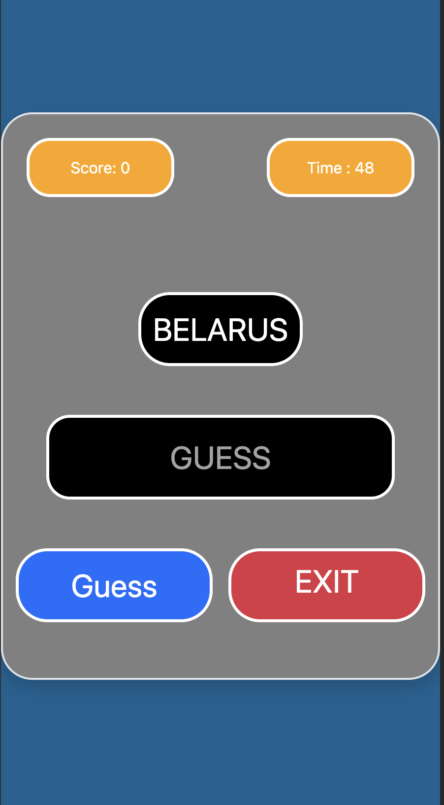

# Capital Guess Game

Welcome to my web page project, where I've used React-JS, Html, CSS and rest API to create a beautiful, responsive and interactive web page.

## Project Overview

This web application serves as a user-friendly tool to play a simple guessing game.

## Screenshots

Here are a couple of screenshots from my project:

## Technologies Used
- React
- Javascript
- HTML
- CSS
- Rest API

### Links
- git clone : https://github.com/Sumeyye-Mete/capital-guess-game.git
- live site URL : https://capital-guess-game.netlify.app/
